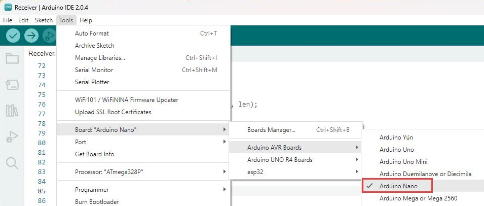
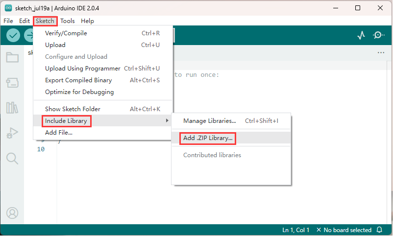
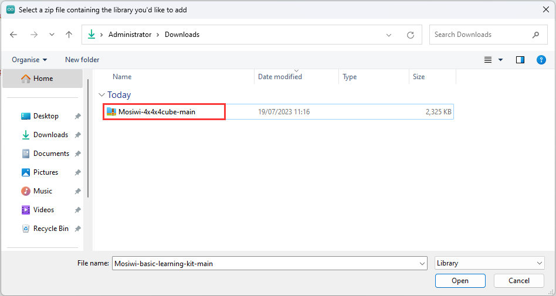
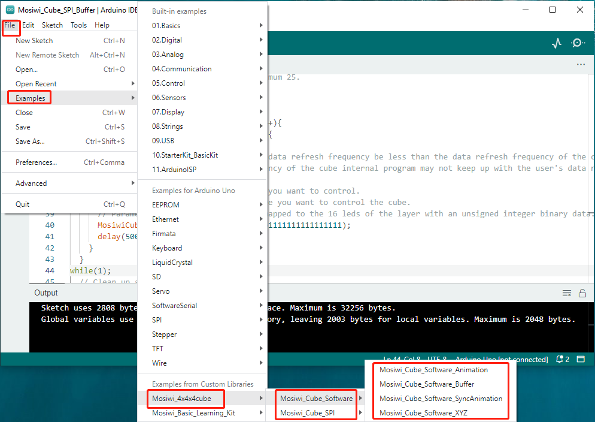

# Arduino_tutorial  
------------------
This tutorial is based on Arduino UNO R3 and Nano!    


**Arduino basics  (Important):**  
If you don't have Arduino basics, you can follow the link to learn the basics: [Click Me](https://docs.mosiwi.com/en/latest/arduino/A1D0000_uno_r3/A1D0000_uno_r3.html)     
1. Learn about UNO R3 motherboards briefly.     
2. Install the Arduino IDE.   
3. Upload the code to UNO R3.   

```{tip}
The Nano is used in a similar way to the UNO R3, but select "Arduino Nano" when selecting the board type.   
```
      

## Wiring diagram
----------------- 
|  UNO or nano  |   Cube   |  
|      :--:     |   :--:   |  
|   5V or 3V3   |   VCC    |  
|      GND      |   GND    |  
|      13       |   SH_C   |  
|      10       |   ST_C   |  
|      11       |   DIN    |  

## Install the Arduino library file
-----------------------------------  
Load the "Mosiwi-4x4x4cube.zip" file downloaded above into the arduino IDE:          
       
Select the compressed library file to load:       


For other methods, see (Option): <https://www.arduino.cc/en/Guide/Libraries>      

## Use the example code in the library file
-------------------------------------------    
If you have successfully loaded the library file, you can open the sample code in the library file in the arduino IDE as follows.   
   

After opening the sample, select the "Arduino UNO" or "Arduino nano" development board, then select the COMx port, and then upload the code to the development board.  

------------
**End!** 
