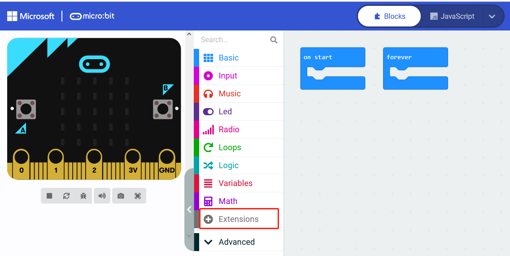
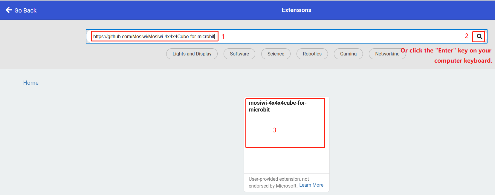
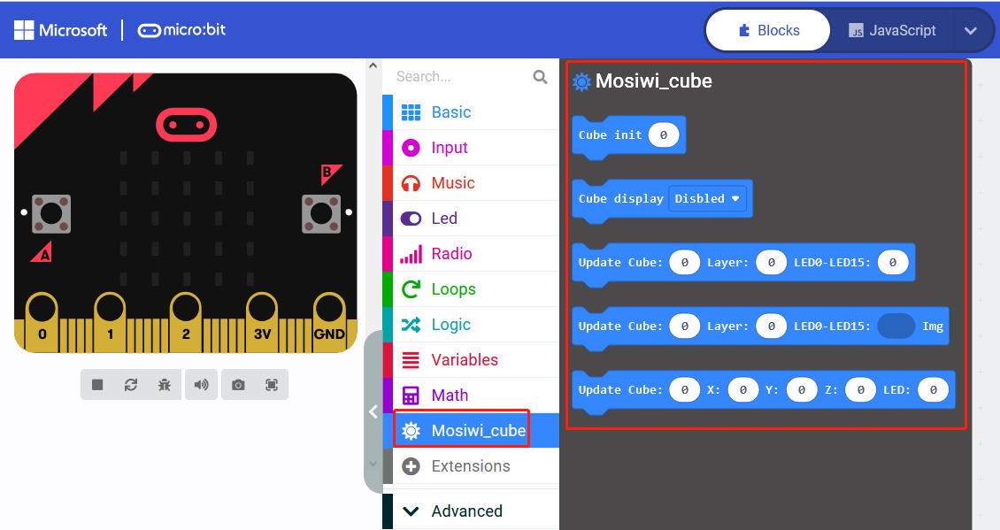
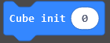
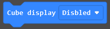
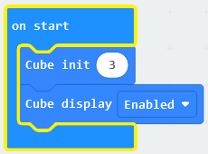
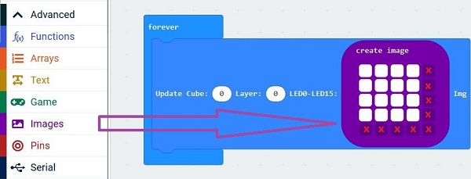
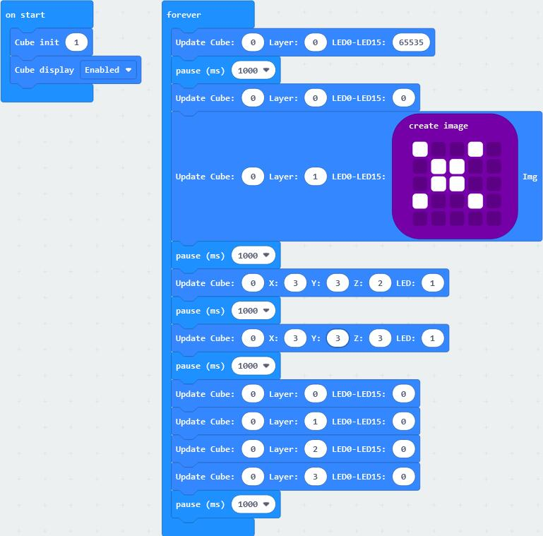

# Micro:bit_tutorial  
--------------------   
**Microbit basics (Important):**   
If you don't have microbit basics, you can follow the link to learn the basics: [Click Me](https://docs.mosiwi.com/en/latest/microbit/M1D0000_microbit_mainboard/M1D0000_microbit_mainboard.html)      
1. Learn about Micro:bit motherboards briefly. 
2. Learn to program with MakeCode.   
3. Upload the code to Micro:bit.  

## Wiring diagram
-----------------  
|    Microbit   |   Cube   |  
|      :--:     |   :--:   |   
|      3V       |   VCC    |  
|      GND      |   GND    |  
|      13       |   SH_C   |  
|      16       |   ST_C   |  
|      15       |   DIN    | 

## Create a new project
-----------------------    
Open the link to create a new online project: <https://makecode.microbit.org>     
      

## Load extension library
-------------------------
  

Fill in the link on the right in the search field to search for extension packs: <https://github.com/Mosiwi/Mosiwi-4x4x4Cube-for-microbit>     
    
Wait for the loading of the library. After the loading is successful, the following figure is shown:   
    

## Block code parsing
---------------------         
1. Initialize and enable   
    
Initializes the total number of concatenated cubes. A maximum of 3 cubes can be concatenated.     
      
Enable all cubes to be concatenated.     
Usage:  
         

2. Light up some leds in the cube by converting a base-2 number to a base-10 number.    
        
Cube: Select a cube in all concatenations. The value can be 0 to 3.     
Layer: Select a layer in the cube. The value can be 0 to 3.   
LED0-LED15: The 16 leds in one layer are mapped to a 16-bit binary number: 0bxxxxxxxxxxxxxxxx. Convert to a decimal number from 0 to 65535.    

3. Light a layer of leds through images.   

Cube: Select a cube in all concatenations. The value can be 0 to 3.      
Layer: Select a layer in the cube. The value can be 0 to 3.   
LED0-LED15: A 5\*5 lattice image uses only its 4\*4 lattice.   
Usage:  
        
"x": invalid      

4. Light an LED in the cube through the coordinates.   
      
Cube: Select a cube in all concatenations. The value can be 0 to 3.        
X, Y, Z: 0 to 3. 
LED: 0 or 1, 0: OFF, 1: ON.  
 
## Example code      
---------------

------------
**End!** 

