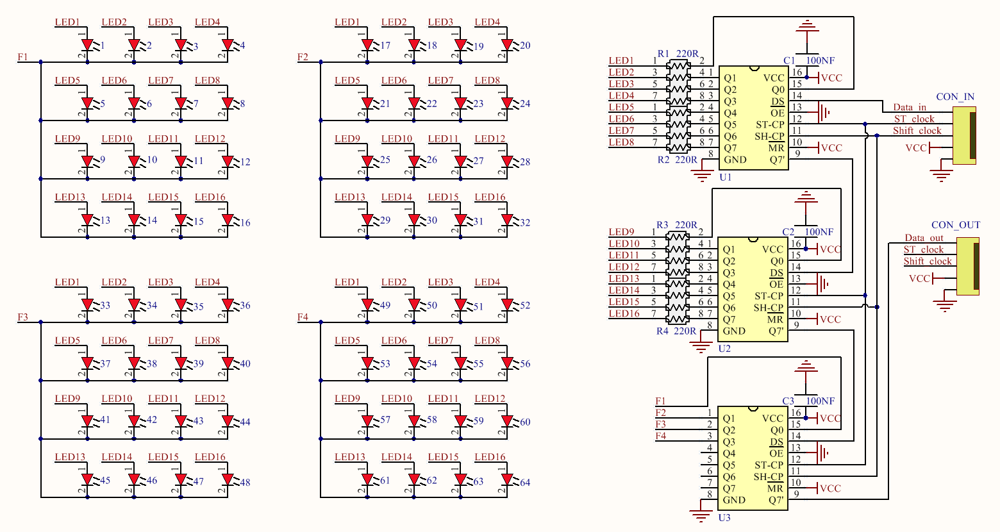
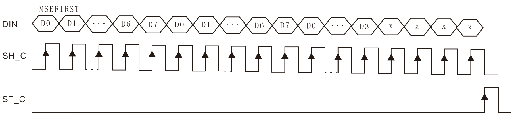

# Optional_resources  
--------------------   
This part explains the inner working principle of the optical cube in depth, and you can check it selectively if you are interested!      

## schematic diagram
--------------------         
        
The light cube has 4 layers (F1, F2, F3, F4), each layer has 16 leds with common cathode wiring, which are controlled by 3 74HC595 serial to parallel data chips. Use the MCU's timing interrupt function to turn on and off the leds in each layer (frequency ≥50Hz) to achieve control of all the leds in the cube.      
[74HC595.pdf](../_static/optional/pdf/74HC595.pdf)

## Communication data format
----------------------------   
A data stream:   
| LEDs | LEDs | Layers |  
| :--: | :--: |  :--:  | 
| 16-15-14-13-12-11-10-9 | 8-7-6-5-4-3-2-1 | F1-F2-F3-F4-1-1-1-1 |   
| D0-D1-D2-D3-D4-D5-D6-D7 | D0-D1-D2-D3-D4-D5-D6-D7 | D0-D1-D2-D3-1-1-1-1 |  

"Dx": 0 or 1.  

A data stream entry protocol:  
  
DIN  = Data_in  
ST_C = ST_clock  
SH_C = Shift_clock, the recommended frequency is less than 25MHz.  

## Timing display format
------------------------  
A cube:  
|      t        |      t        |      t        |      t        |      t        |      ....     |      t        |      ....     |  
|     :--:      |     :--:      |     :--:      |     :--:      |     :--:      |      :--:     |     :--:      |      :--:     |  
|    Laye 4     |    Laye 3     |    Laye 2     |    Laye 1     |    Laye 4     |      ....     |    Laye 1     |      ....     |  
| A data stream | A data stream | A data stream | A data stream | A data stream |      ....     | A data stream |      ....     |  

t: MCU timer interrupt time.  
Cube display frequency: It must be ≥ 50Hz, f = 1s/(t \* 4)  

Series multiple cubes:   
|      T        |      T        |     ....      |      T        |      T        |       T       |      ....     |  
|     :--:      |     :--:      |     :--:      |     :--:      |     :--:      |      :--:     |      :--:     |  
|    Cube N     |   Cube N-1    |     ....      |    Cube 2     |    Cube 1     |     Cube N    |      ....     |  

T: The MCU timer displays the time of a cube, T = (t\*4).  
Cube display frequency: It must be ≥ 50Hz, f = 1s/(T \* N)   

--------
**End!**    

