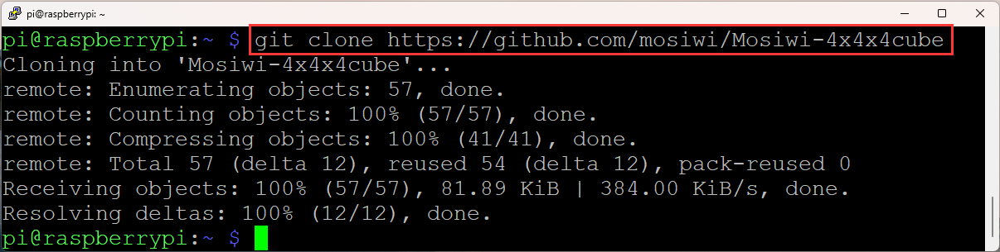

# Raspberry_pi4_tutorial
------------------------
**Pi4 basics (Important):**   
If you don't have Pi4 basics, you can follow the link to learn the basics: [Click Me](https://docs.mosiwi.com/en/latest/raspberry/R1D0000_raspberry_pi4/R1D0000_raspberry_pi4.html)     
1. Learn about [Raspberry pi4](https://docs.mosiwi.com/en/latest/raspberry/R1D0000_raspberry_pi4/R1D0000_raspberry_pi4.html) briefly.    
2. Learn to [launch Raspberry Pi](https://docs.mosiwi.com/en/latest/raspberry/resources/get_started_with_raspberry_pi/get_started_with_raspberry_pi.html).
3. Learn [simple linux operation instructions](https://docs.mosiwi.com/en/latest/raspberry/resources/get_started_with_raspberry_pi/get_started_with_raspberry_pi.html#linux-command).   

Install the GPIO library for Raspberry pi4 (<span style="color: rgb(255, 76, 65);">Necessary condition</span>):                 
1. Install the [Wiringpi](https://docs.mosiwi.com/en/latest/raspberry/wiringpi/wiringpi.html)   
2. Install the [BCM2835](https://docs.mosiwi.com/en/latest/raspberry/bcm2835/bcm2835.html)     

## Wiring diagram
-----------------   
| pi4(Wiringpi) |   pi4(BCM)    |   Cube   |  
|     :--:      |      :--:     |   :--:   |    
|   5V or 3V3   |   5V or 3V3   |    VCC   |  
|      GND      |    GND        |    GND   |  
|      14       |    GPIO 11    |    SH_C  |  
|      10       |    GPIO 8     |    ST_C  |  
|      12       |    GPIO 10    |    DIN   |  

## Get source code
------------------      
```{tip}   
The library files are downloaded in the "[Previous_tutorial](https://docs.mosiwi.com/projects/c1k0001/en/latest/previous_tutorial/previous_tutorial.html#download-library-file)" section!
```

**Method 1:**   
Use **WinSCP** to upload the downloaded library file to Raspberry Pi4: [Link](https://docs.mosiwi.com/en/latest/raspberry/resources/get_started_with_raspberry_pi/get_started_with_raspberry_pi.html#transfer-files-from-your-pc-to-raspberry-pi)     

**Method 2:**    
Open the Raspberry pi4 or [Git](https://git-scm.com/) terminal and run the following command to download it from github.     
```    
 git clone https://github.com/mosiwi/Mosiwi-4x4x4cube    
```           
             
(Terminal of Raspberry pi4)

**Add execute permissions for the files:**     
```
 cd ~/Mosiwi-4x4x4cube/Pi4/c/examples/3wire/
 sudo chmod 777 cube Makefile

 cd ~/Mosiwi-4x4x4cube/Pi4/c/examples/spi/
 sudo chmod 777 cube Makefile
```

## Run code
-----------     
3wire example.      
```   
cd ~/Mosiwi_4x4x4cube\Pi4\c\examples\3wire    

sudo ./cube   
```   

SPI example.     
```   
cd ~/Mosiwi_4x4x4cube\Pi4\c\examples\spi   

sudo ./cube   
```   

If you update the execution file or modify the source code, you need to recompile the code.     
```   
sudo make    
```   

------------
**End!** 