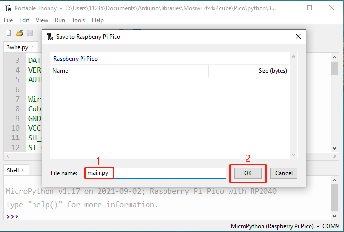

# Raspberry_pico_tutorial  
-------------------------
**Pico and Thonny basics (Important):**        
If you don't have Pico and Thonny basics, you can follow the link to learn the basics:       
1. Learn about [Pico](https://docs.mosiwi.com/en/latest/raspberry/R1D0001_raspberry_pico/R1D0001_raspberry_pico.html) briefly.     
2. Install the [Thonny](https://docs.mosiwi.com/en/latest/raspberry/R1D0001_raspberry_pico/R1D0001_raspberry_pico.html#using-micropython-in-thonny) IDE.   
3. [Upload the code to Pico](https://docs.mosiwi.com/en/latest/raspberry/R1D0001_raspberry_pico/R1D0001_raspberry_pico.html#save-existing-files-or-folders-to-pico).   

## Wiring diagram
-----------------   
|      pico     |   Cube   |  
|      :--:     |   :--:   |   
|  VBUS or 3V3  |   VCC    |  
|      GND      |   GND    |  
|      18       |   SH_C   |  
|      17       |   ST_C   |  
|      19       |   DIN    |   

## Use the pico example code
----------------------------      
Unzip the "Mosiwi-4x4x4cube.zip" file you [downloaded above](../previous_tutorial/previous_tutorial.md#download-library-file):            
                

Make sure your Raspberry PI Pico's USB is plugged into your computer's USB via a usb cable, then click on **"Python"** and the version number in the bottom right corner of the Thonny window, then select "**MicroPython(Raspberry PI Pico)". COMx** ".     
    

Open the example code in Thonny as follows:             
   

```{note}
Only when the Pico is connected to Thonny will a window pop up allowing you to select "This computer" and "Raspberry Pi Pico"!    
```     

  

```{tip}
There are two communication methods in the example code, they are basically the same effect, but the "spi" communication method is faster, choose one of them!       
```

Run the code online. (The code is not saved in pico and is not executed after repowering.)    


Run the code offline. (The code is stored in pico, and the code in pico is automatically executed after being powered on.)   
| 1 |  
|:---:|   
|  |   
| 2 |  
|  |      
| 3 |    
|  |    

```{tip}
Online operation requires that the Pico board is always connected to the PC, offline operation does not need to be, according to the actual situation to choose the operation mode you need.
```

------------
More Pico learning Resources: [Click me](https://docs.mosiwi.com/projects/c1k0000/en/latest/pico_tutorial/basic_tutorial.html)

**End!** 