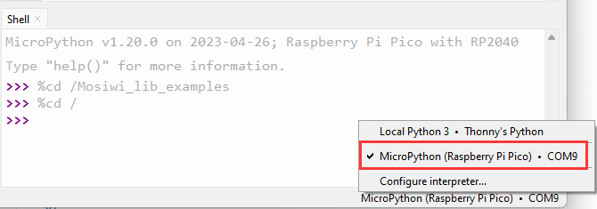
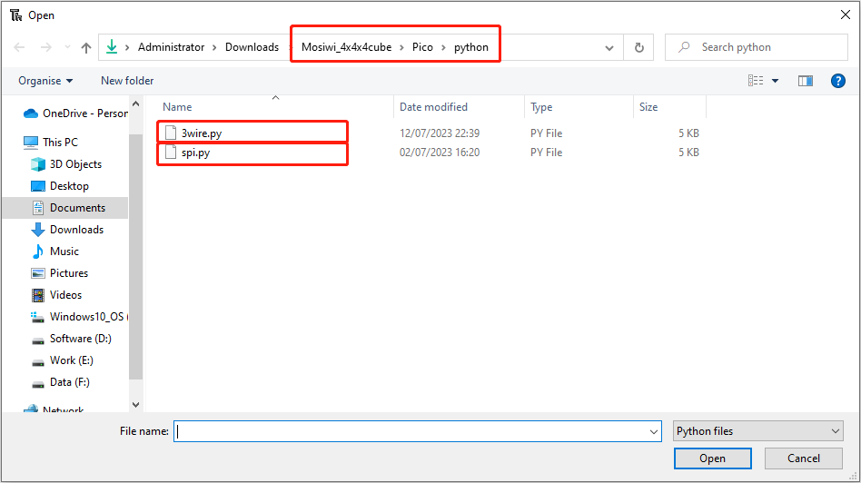

# Raspberry_pico_tutorial  
-------------------------
**Pico and Thonny basics (Important):**        
If you don't have Pico and Thonny basics, you can follow the link to learn the basics: [Click Me](https://docs.mosiwi.com/en/latest/raspberry/R1D0001_raspberry_pico/R1D0001_raspberry_pico.html)   
1. Learn about Pico motherboards briefly.     
2. Install the Thonny IDE.   
3. Upload the code to Pico.   

## Wiring diagram
-----------------   
|      pico     |   Cube   |  
|      :--:     |   :--:   |   
|  VBUS or 3V3  |   VCC    |  
|      GND      |   GND    |  
|      18       |   SH_C   |  
|      17       |   ST_C   |  
|      19       |   DIN    |   

## Use the pico example code
----------------------------      
Unzip the "Mosiwi-4x4x4cube.zip" file you [downloaded above](./previous_tutorial.md#download-library-file):            
                

Open one of the sample code as follows.  
   
   
  

Run the code online. (The code is not saved in pico and is not executed after repowering.)    


Run the code offline. (The code is stored in pico, and the code in pico is automatically executed after being powered on.)   
| 1 | 2 | 3 |
|:---:|:---:|:---:|
|  |  |  |

```{tip}
Online operation requires that the Pico board is always connected to the PC, offline operation does not need to be, according to the actual situation to choose the operation mode you need.
```

------------
**End!** 