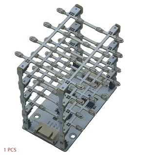
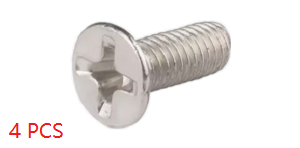
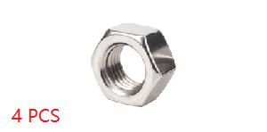
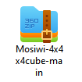

# Previous_tutorial  
-------------------
  
This is a very interesting light cube that can be used for learning programming or as an ambient light. When used for learning programming, we provide rich sample code such as Arduino, Raspberry pi 4B, Micro:bit, and Raspberry pi pico. This light cube also has an excellent feature, which is that multiple light cubes can be connected together in series, and they can be controlled simultaneously or independently using the MCU.    
(No welding, can be assembled in 10 minutes.)   

## Specification     
----------------
1. Operating Voltage: 3.3 to 5V  
2. Operating Current: Max 220mA/1pcs  
3. Interface: 3-Wire or SPI  
4. Lighting frequency: ≥ 50Hz  
5. Weight: about ?g  
6. Dimensions: 79\*79\*85.4mm  

## List    
-------
| PCB cube | Acrylic cube | HX-2.54 4P to M-duport wire | HX-2.54 4P to F-duport wire |
| :--: | :--: | :--: | :--: |
|  |  |  |  |    
| HX-2.54 4P M-M wire | M3\*8mm flat-head screw | M3 nuts |  |    
|  |  |  |  |   

## Series method  
----------------
If you have multiple cubes, you can string them together as follows.    
    

## Download library file     
------------------------
Download resource: <https://github.com/mosiwi/Mosiwi-4x4x4cube>  
1. For Arduino UNO and NANO: C++ && C_language  
2. For Raspberry pi4: C_language    
3. For Raspberry pi pico: Python 

The downloaded zip file will be used in later tutorials:  

